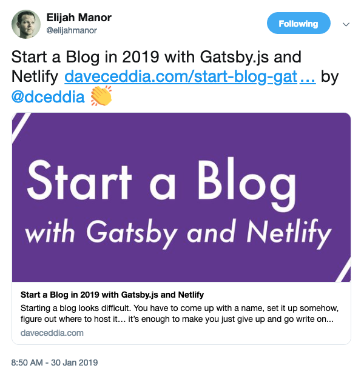

Inspired by this tweet from [Elijah Manor](https://twitter.com/elijahmanor)

i decided to setup my own blog.

I quickly read through [this blog post](https://daveceddia.com/start-blog-gatsby-netlify/) by [Dave Ceddia](https://twitter.com/dceddia) and though at first I should just host this on my own server since I already have one.

Because I haven't finished configuring nginx on my server for subdomains and https I decided to check out [Netlify](https://netlify.com).

Less than an hour later, this blog is up and running. I'm still waiting on DNS propagation so https will activate, but the whole process was very easy.
